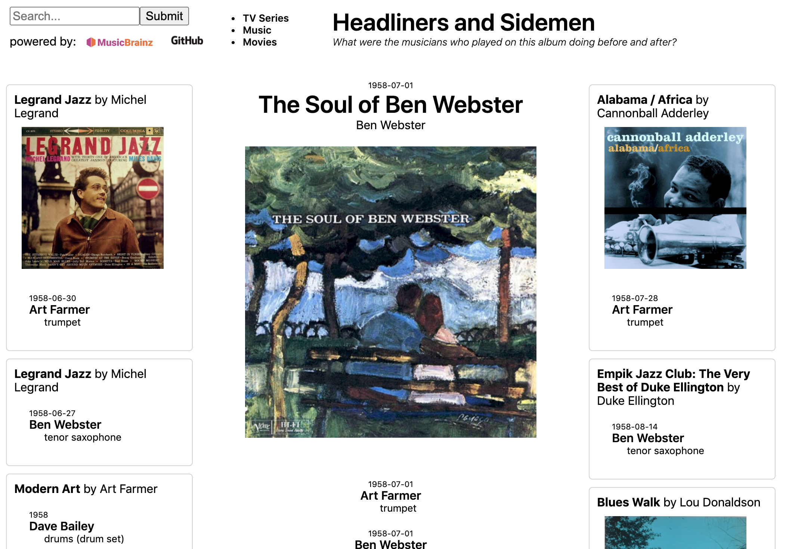
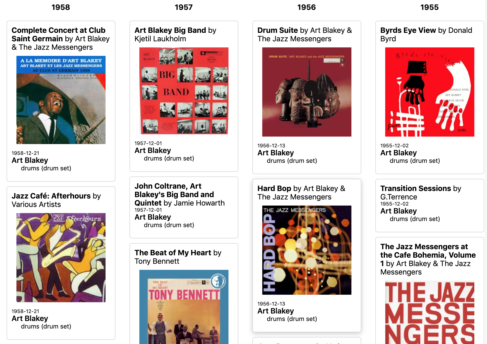

This is a [Next.js](https://nextjs.org/) project bootstrapped with [`create-next-app`](https://github.com/vercel/next.js/tree/canary/packages/create-next-app).

# Headliners and Sidemen



You have found an album you like and you want more.  Where do you look?

- **"more like this"** shows other albums that people who enjoyed this album have disproportionately liked
- **curated lists** show samples from genres containing thousands of albums
- you can **search** the album title or headliner and browse the hitlist
- by "liking" the album your **personal recommendations** may change slightly

This app presents a new method.

- by exploring the **area around your album**

The *area around your album* is defined in a specific and objective way.   For each artist who played on your album, find the last album they recorded before and the first album they recorded after recording your album. 

The interface lets you navigate the **colaboration graph** of albums related by the personnel they have in common.

## Collaboration Graphs

The usual definition has 
- nodes: musicians
- edges: two musicians are connected if they appear on the same album

These graphs are used to calculate degress of separation between musicians.  Examples are the
six degress of Kevin Bacon (actors in movies) and Erdos Number (mathematicians collaborating on math papers).


Here we are using the same data organized in a different way:

- nodes: musicians and albums
- edges: musicians are connected to the albums they recorded for, but they are not connected to each other

Each edge has an important attribute:  the date of the recording.  Often an album has contributions from different dates, so the selection of nearby albums uses each musician's recording dates to find the last before and first after.

## Artist Releases



Since we have the collaboration graph, we can show the complete history of a musicians appearances, on their own albums and those of other people.  The results are displayed in columns by year.


## Data

The data is from [musicbrainz](https://musicbrainz.org/doc/MusicBrainz_Database).  


Here is the data extraction query, instantiated from a template for this range of id's.

```
select rg.id as release_group,
  rg.name as title,
  rga.name as headliner, 
  rga.id as headliner_id,
  a.name as artist,
  a.id as artist_id,
  lat.name as instrument, 
  min(make_date(l.begin_date_year, 
       coalesce(l.begin_date_month,1), 
       coalesce(l.begin_date_day,1))) as begin_date, 
  max(make_date(l.end_date_year, 
       coalesce(l.end_date_month,1), 
       coalesce(l.end_date_day,1))) as end_date
from release_group as rg
join release as r on r.release_group = rg.id
join artist as rga on rga.id = rg.artist_credit
join medium as m on m.release = r.id
join track as t on t.medium = m.id
join l_artist_recording as ar on ar.entity1 = t.recording
join artist a on a.id = ar.entity0
join link as l on l.id = ar.link
join link_attribute as la on la.link = l.id
join link_attribute_type as lat on lat.id = la.attribute_type
where rg.id between 1049000 and 1050000
and l.begin_date_year is not null
group by 1,2,3,4,5,6,7
;
```

Sample results:
```
2717	Abbey Road	The Beatles	303	George Harrison	2863	piano	1969-02-25	1969-02-25
2717	Abbey Road	The Beatles	303	George Harrison	2863	synthesizer	1969-08-19	1969-08-19
```


