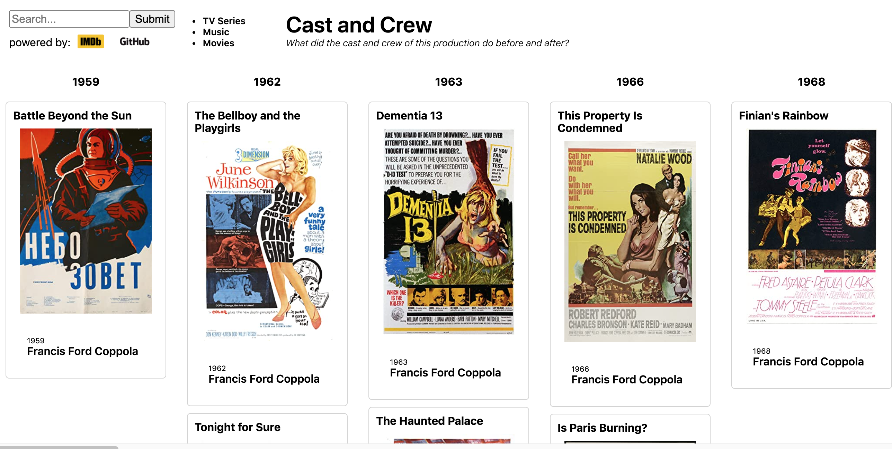

This is research tool for students, critics, collectors, and consumers.

A movie, TV series, or audio recording is a project that brings together a team of artists.  It is a point in time when their careers intersect.  

We can use this structure to define the neighborhood of a project.

> The **<i>neighborhood</i>** of a project consists of each team member's previous and next projects.

The interface presents this neighborhood, and lets you click the before and after projects in the left and right columns to follow an artist's career.

 
# Why?

Personalized recommendations and "more like this" lists show you what is popular among people like you, since they are derived from the behavior of crowds. It works well for recent releases where there is lots of data. But if nobody saw X, there's no crowd-sourced data about it, and it is invisible to recommendations.

Curated lists are small extracts of a vast ocean of content, and search takes more energy than you want to spend on entertainment.

Here, the connections are entirely objective.  Projects are linked by the co-occurrence of artists.  Popularity is not involved.  It doesn't matter what the rest of the world thinks. 

The result is that you can easily follow a chain of links and find yourself in a sub-basement of IMDb.

>If you like things other people don't, this is for you.


# Music

A few days before recording for Ben Webster's album, Art Farmer played trumpet for Michel Legrand.  A month later he played on Cannonball Adderly's album "alabama/africa".  He is a headliner on many albums, a sideman on these three.

[](https://headliners-and-sidemen.herokuapp.com/release_group/de2c03d0-5eaa-3934-b616-2ef7f0959895)

# TV Series

A year before The West Wing, Aaron Sorkin wrote Sports Night.  After, he wrote Studio 60.

[](https://cast-and-crew.herokuapp.com/release_group/tt0200276)

# Movies
The year before making True Romance, Christian Slater did a movie calls Kuffs, and the same year he did Untamed Heart.

[](https://movies-and-actors.herokuapp.com/release_group/tt0108399)

## Careers

Francis Ford Coppola's early career.  For the rest, click and scroll right.

[](https://movies-and-actors.herokuapp.com/artist_releases/nm0000338)


## Data

### Music

The data is publicly available from [musicbrainz](https://musicbrainz.org/doc/MusicBrainz_Database).  

Here is the data extraction query.  

```
select rg.id as release_group,
  rg.name as title,
  rga.name as headliner, 
  rga.id as headliner_id,
  a.name as artist,
  a.id as artist_id,
  lat.name as instrument, 
  min(make_date(l.begin_date_year, 
       coalesce(l.begin_date_month,1), 
       coalesce(l.begin_date_day,1))) as begin_date, 
  max(make_date(l.end_date_year, 
       coalesce(l.end_date_month,1), 
       coalesce(l.end_date_day,1))) as end_date
from release_group as rg
join release as r on r.release_group = rg.id
join artist as rga on rga.id = rg.artist_credit
join medium as m on m.release = r.id
join track as t on t.medium = m.id
join l_artist_recording as ar on ar.entity1 = t.recording
join artist a on a.id = ar.entity0
join link as l on l.id = ar.link
join link_attribute as la on la.link = l.id
join link_attribute_type as lat on lat.id = la.attribute_type
where l.begin_date_year is not null
group by 1,2,3,4,5,6,7
;
```

Sample results:
```
10226	Blue Rondo	The Dave Brubeck Quartet	5444	Randy Jones	477140	drums (drum set)	1986-11-01	\N
10229	Red Holloway & Company	Red Holloway	5483	Cedar Walton	51394	piano	1987-01-01	\N
10229	Red Holloway & Company	Red Holloway	5483	Jimmie Smith	615236	drums (drum set)	1987-01-01	\N
10229	Red Holloway & Company	Red Holloway	5483	Red Holloway	5483	saxophone	1987-01-01	\N
10229	Red Holloway & Company	Red Holloway	5483	Richard Reid	1209898	bass	1987-01-01	\N
10231	Marian McPartland Plays the Music of Billy Strayhorn	Marian McPartland	5285	Jerry Dodgion	359201	alto saxophone	1987-03-01	\N
```

There are 67,615 musicians (artists) connected to 92,044 albums (release groups) through 1,018,092 recordings, extracted from a total of 2,351,000 albums.

Table schema for run-time queries:
```
                         Table "public.context"
    Column     |          Type          | Collation | Nullable | Default 
---------------+------------------------+-----------+----------+---------
 release_group | integer                |           |          | 
 title         | character varying      |           |          | 
 headliner     | character varying      |           |          | 
 headliner_id  | integer                |           |          | 
 artist        | character varying      |           |          | 
 artist_id     | integer                |           |          | 
 instrument    | character varying(255) |           |          | 
 begin_date    | date                   |           |          | 
 end_date      | date                   |           |          | 
 cover_url     | text                   |           |          | 
Indexes:
    "idx_con_aid" btree (artist_id)
    "idx_con_artist" btree (artist)
    "idx_con_rg" btree (release_group)
    "idx_con_title" btree (title)
```

## Movies and TV

Built using the public data available here:

https://www.imdb.com/interfaces/

Main query for movies:

```
select 
    cast (replace(tb.tconst, 'tt', '') as int) as release_group,
    cast (tb.primaryTitle as character varying) as title, 
    cast('' as character varying) as headliner,
    -1 as headliner_id,
    cast (nb.primaryName as character varying) as artist,
    cast (replace(nb.nconst, 'nm', '') as int) as artist_id,
    cast(tp.characters as varchar(255)) as instrument,
    make_date(tb.startYear,1,1) as begin_date,
    make_date(1900,1,1) as end_date,
    null as cover_url
from title_basics as tb
join title_principals as tp on tp.tconst = tb.tconst
join name_basics as nb on nb.nconst = tp.nconst
where tb.titleType = 'movie'
limit 50000000
;
```

## Strategy

Using a postgres window function, assign a sequential number to each artist's work.  

```
select 
  c.*,
  cast(
      ROW_NUMBER() OVER (
      PARTITION by c.artist_id
      ORDER BY c.begin_date
    ) as int) as artist_seq
from context as c;
```

Use it at runtime to find the first project after this one by adding 1.

```
with all_after as (
  select 
    c2.*, 
    1 as rank
  from context as c 
  join context as c2 on c2.artist_id = c.artist_id 
    and c2.artist_seq = c.artist_seq + 1
  where c.release_group = _release_group_id 
  order by c2.artist, c2.begin_date
)
select *
from all_after as ab
order by ab.artist;
```

## Implementation

The postgres database is hosted on an e2-micro (2 vCPUs, 1 GB memory) running on Google Compute Engines.

The app is built with nextjs and is hosted on both heroku and vercel.
- [heroku](https://headliners-and-sidemen.herokuapp.com/)
- [vercel](https://headliners-and-sidemen.vercel.app/)

## Issues and Comments

Something missing or not as good as it could be?  Feel free to add an issue to this GitHub repo.  

 Do you wish Spotify, Amazon, Netflix, and HBO would use a browser like this?  Feel free to add comments. 